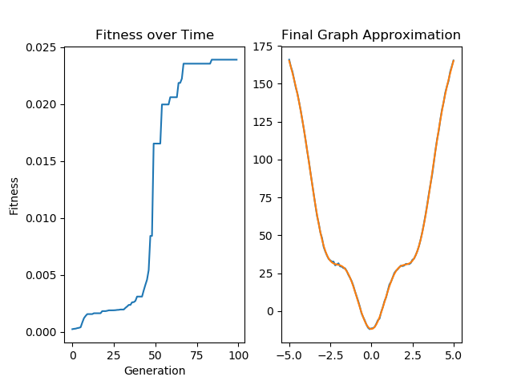

# Function Parameters Approximation using Evolutionary Algorithms

Program provides 3 approximated parameters to the given origin function, using evolutionary algorithm as an optimization tool.
It incudes both (µ, λ) and (µ + λ) approches as well as discrete and intermediate crossovers.

### Prerequisites

Program written in Python (Version 3.7.1) as a PyCharm project.

Packages required:  
-> matplotlib  
-> pandas

### Run

To run the algorithm with default parameters, import the package and use 'run()' function.  

## Customization

There are four arguments of the run() fuction that can be modified.

```
file_path - Path to the data file.
pop_size - Number of individuals in the population.  
max_gen - Maximal number of generations.  
mi - Number of individuals in the next generation.  
```

Origin function can be modified inside the program code.

```
def origin_function(a, b, c, x):
    return a * (x ** 2 - b * cos(c * pi * x))
```    

Data file with points should be provided in csv or txt file with the header (x, y) as in appended exemplary file 'model15.txt'

## Results 

After program finishes final iteration, approximate values of the parameters are displayed in console and plot presenting the difference between target and achieved function is displayed.

Output for the default parameters:



*On the second graph, blue line represent target function while orange line represents our approximation.

After last generation is calculated, the best solution and it's value is printed out.

```
Final Parameters: 
a=6.500793079036527
b=1.6460720558921502
c=0.6782485403958269
```
